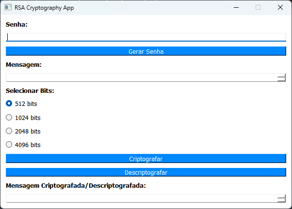

<div align="center">

# 📜 py-crypt-messages

O projeto **py-crypt-messages** é uma interface GUI para criptografia e descriptografia de mensagens usando o algoritmo RSA. Foi desenvolvido em Python utilizando a biblioteca PyQt5 e a biblioteca de criptografia cryptography.



</div>

## 📝 Descrição do Projeto

O **py-crypt-messages** é um aplicativo que permite inserir uma mensagem, gerar uma senha ou inserir uma senha personalizada e criptografar ou descriptografar a mensagem usando o algoritmo de criptografia RSA. O aplicativo oferece uma interface intuitiva, permitindo selecionar o tamanho dos bits para a geração das chaves RSA.

## ⚙️ Funcionalidades

- Gerar uma senha aleatória ou inserir uma senha personalizada.
- Inserir uma mensagem para criptografar ou descriptografar.
- Selecionar o tamanho dos bits para a geração das chaves RSA (512, 1024, 2048, 4096).
- Criptografar a mensagem usando o algoritmo de criptografia RSA.
- Descriptografar a mensagem criptografada.
- Exibir a mensagem criptografada ou descriptografada no campo de saída.

## 📋 Pré-requisitos

Antes de executar o projeto **py-crypt-messages**, verifique se você possui os seguintes pré-requisitos instalados em seu ambiente:

- Python 3.x
- PyQt5
- cryptography

## 🚀 Instalação

1. Certifique-se de ter o Python 3.x instalado em seu sistema.
2. Instale as dependências necessárias executando o seguinte comando no terminal:


pip install PyQt5 cryptography


3. Baixe ou clone este repositório em seu ambiente local.

## 💻 Uso

1. Navegue até o diretório do projeto e execute o arquivo `main.py`:


python main.py


2. A interface gráfica do **py-crypt-messages** será aberta.

3. Insira uma senha no campo "Senha" ou clique em "Gerar Senha" para gerar uma senha aleatória.

4. Insira a mensagem que você deseja criptografar ou descriptografar no campo "Mensagem".

5. Selecione o tamanho dos bits para a geração das chaves RSA.

6. Clique no botão "Criptografar" para criptografar a mensagem.

7. Clique no botão "Descriptografar" para descriptografar a mensagem criptografada.

8. A mensagem criptografada ou descriptografada será exibida no campo de saída correspondente.

## 🧩 Código-fonte

Aqui está o código-fonte do arquivo `main.py` que implementa o projeto **py-crypt-messages**:

```python
import sys
import random
import string
from PyQt5.QtWidgets import QApplication, QWidget, QLabel, QLineEdit, QPushButton, QVBoxLayout, QTextEdit, QRadioButton, QButtonGroup
from PyQt5.QtGui import QPalette, QColor, QFont
from PyQt5.QtCore import Qt
from cryptography.hazmat.primitives.asymmetric import rsa, padding
from cryptography.hazmat.primitives import serialization, hashes

class RSAApp(QWidget):
    # Código omitido para maior clareza
    ...

if __name__ == "__main__":
    app = QApplication(sys.argv)
    # Código omitido para maior clareza
    ...


🤝 Contribuição
Contribuições para o projeto py-crypt-messages são bem-vindas. Se você deseja contribuir, siga as etapas abaixo:

Faça um fork deste repositório.
Crie um novo branch para a sua feature (git checkout -b feature/nova-feature).
Faça as alterações necessárias no código.
Faça o commit das suas alterações (git commit -am 'Adicione uma nova feature').
Faça o push para o branch (git push origin feature/nova-feature).
Abra um pull request neste repositório.
📝 Licença
Este projeto está licenciado sob a MIT License.

